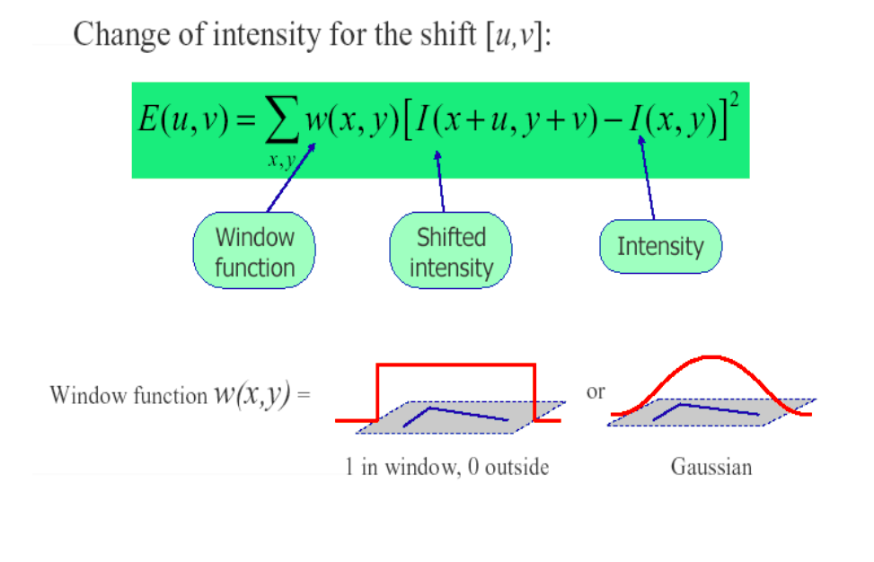
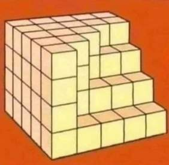
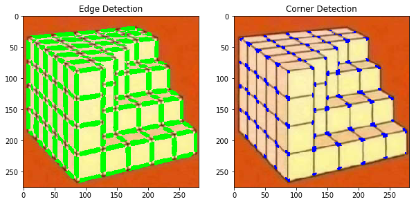

 

  <h3 align="center">Harris Corner Detector</h3>

  

    An implementation of a simple Harris corner detector in python
     
    

    <h3>
    The Harris corner detection algorithm is one of the simplest corner detectors available. The idea is to locate interest points where the surrounding neighbourhood shows edges in more than one direction. The basic idea of algorithm is to find the difference in intensity for a displacement of (u,v) in all directions which is expressed as below:
    </h3>
     
    

     
    <h3>This code follows the steps given below to get the output:
    <ul>
    <li> Conversion of Image to grayscale (We are only interested in intensities)</li>
    <li> Calculation of the image gradient along x and y direction</li>
    <li>Harris response calculation by running required window over the image</li>
    <li>Finding the edges and corners by comparing harris response with threshold values</>
    </h3>
    

    <h2>Example Output of the algorithm</h2>
    
 <h3>Sample Input Image</h3>  

    
 <h3>Output Image</h3>  

    
  
  

